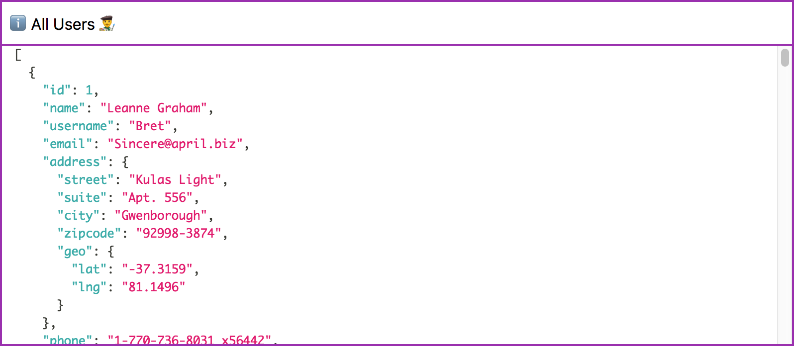

# vue-dump

[ ](https://www.npmjs.com/package/vue-dump)
[](https://vuejs.org/)

A Vue.js component that dumps data for debugging


## Table of contents

* [Installation](#installation)
* [Usage](#usage)
* [Example](#example)

# Installation

```
npm install --save vue-dump
```

## Default import

Install all the components:

```javascript
import Vue from 'vue';
import VueDump from 'vue-dump';

Vue.use(VueDump);
```

Use specific components:

```javascript
import Vue from 'vue';
import { DataDump } from 'vue-dump';

Vue.component('dump', DataDump);
```

**⚠️ A css file is included when importing the package. You may have to setup your bundler to embed the css in your page.**

## Distribution import

Install all the components:

```javascript
import 'vue-dump/dist/vue-dump.css';
import VueDump from 'vue-dump/dist/vue-dump.common';

Vue.use(VueDump);
```

Use specific components:

```javascript
import 'vue-dump/dist/vue-dump.css';
import { DataDump } from 'vue-dump/dist/vue-dump.common';

Vue.component('dump', DataDump);
```

**⚠️ You may have to setup your bundler to embed the css file in your page.**

## Browser

```html
<link rel="stylesheet" href="vue-dump/dist/vue-dump.css"/>

<script src="vue.js"></script>
<script src="vue-dump/dist/vue-dump.browser.js"></script>
```

The plugin should be auto-installed. If not, you can install it manually with the instructions below.

Install all the components:

```javascript
Vue.use(VueDump);
```

Use specific components:

```javascript
Vue.component('dump', VueDump.DataDump);
```

## Source import

Install all the components:

```javascript
import Vue from 'vue';
import VueDump from 'vue-dump/src';

Vue.use(VueDump);
```

Use specific components:

```javascript
import Vue from 'vue';
import { DataDump } from 'vue-dump/src';

Vue.component('dump', DataDump);
```

**⚠️ You need to configure your bundler to compile `.vue` files.** More info [in the official documentation](https://vuejs.org/v2/guide/single-file-components.html).

# Usage

```html
<dump :data="user" label="The User 👨‍🎨"></dump>
```

## API

| Prop    | Description                                                             |
| ------- | ----------------------------------------------------------------------- |
| `data`  | The data to be dumped. Can be anything. JSON data, Arrays, Objects etc. |
| `label` | The title at the top to convey what's dumped.                           |

# Example

```html
<template>
    <dump :data="user" label="The User 👨‍🎨"></dump>
</template>

<script>
export default {
    data() {
        return {
            user: {
                name: 'John Doe'
                email: 'john.doe@gmail.com'
            }
        }
    }
}
</script>
```

---

# Plugin Development

## Installation

The first time you create or clone your plugin, you need to install the default dependencies:

```
npm install
```

## Watch and compile

This will run webpack in watching mode and output the compiled files in the `dist` folder.

```
npm run dev
```

## Use it in another project

While developping, you can follow the install instructions of your plugin and link it into the project that uses it.

In the plugin folder:

```
npm link
```

In the other project folder:

```
npm link vue-dump
```

This will install it in the dependencies as a symlink, so that it gets any modifications made to the plugin.

## Publish to npm

You may have to login to npm before, with `npm adduser`. The plugin will be built in production mode before getting published on npm.

```
npm publish
```

## Manual build

This will build the plugin into the `dist` folder in production mode.

```
npm run build
```

---

## License

[MIT](LICENSE)

## Thanks

Huge thanks to @Akyrum - https://github.com/Akryum/vue-share-components/
